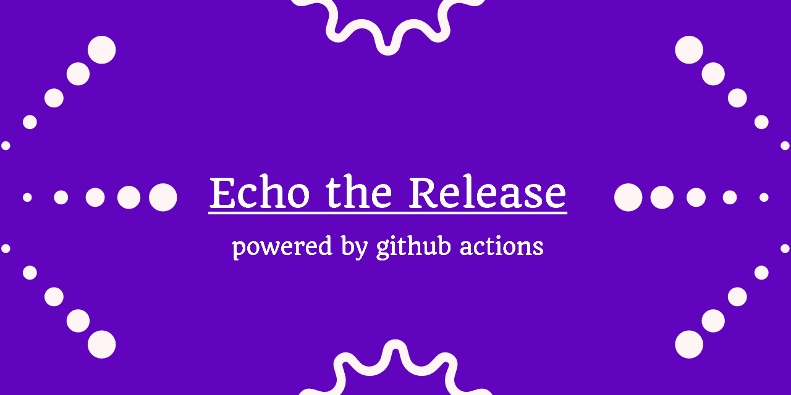

# Echo-The-Release

[](https://dev.to/qainsights/)
[](https://saythanks.io/to/catch.nkn%40gmail.com)
[](https://qainsights.com)
[](https://qainsights.com)
[](https://www.youtube.com/user/QAInsights?sub_confirmation=1)

This GitHub action notifies your Echo device if there is a new release of your favorite GitHub repos that you have been following.



# How to use this GitHub Action?

Following are the prerequisites to configure the notifications.

* Compatible Echo device such as Echo, Echo Show etc.
* Free account at [Thomptronics](https://www.thomptronics.com/about/notify-me). Follow the steps mentioned [here](https://www.thomptronics.com/about/notify-me#h.p_GOawS1aQOduh) to integrate your Echo and `Notify Me` skill.
* List of GitHub repositories that you are following and their API should expose the release details. E.g. `https://api.github.com/repos/QAInsights/Sample-Repo/releases/latest` is exposing the release, tag etc.

Steps to configure this action:

* Fork this repo.
* Create a folder for each repository that you need to be alerted. Inside each folder, create `echo.txt` file.
* Create a Repo scoped token and configure under your secret `ECHO_KEY`
* Configure Notify Me API key under your secret `ECHO_TOKEN`
* Configure the below YAML to suite your needs. You can add multiple repositories. Recommended count is 5, because of the Notify Me API limitations.
```
name: Echo the Release
on: 
  schedule:
    - cron: "*/1 * * * *"
jobs:
  get-version:
    runs-on: ubuntu-latest
    steps:
    - uses: actions/checkout@v2
      with:
        token: ${{ secrets.ECHO_TOKEN }}
    - name: Repo 1
      run: |
        t=$(curl -sL https://api.github.com/repos/<UserName>/<RepoName>/releases/latest | jq -r ".name")
        if [ ${t} != null ]
        then
          echo ${t} > Sample-Repo/echo.txt
        fi
                
    - name: Repo 2
      run: |
        t=$(curl -sL https://api.github.com/repos/<UserName>/<RepoName>/releases/latest | jq -r ".name")
        if [ ${t} != null ]
        then
          echo ${t} > Another-Sample-Repo/echo.txt
        fi
     
    - name: Check for modified files
      id: git-check
      run: | 
        git diff --name-only | xargs -L1 dirname | uniq > changes.txt
        while read p; do
          if [ $p != "." ]
          then
            k=${{ secrets.ECHO_KEY }}
            curl https://api.notifymyecho.com/v1/NotifyMe -H "Content-Type: application/json" -d '{"notification":"New release is now available for '"$p"'.","accessCode":"'"$k"'"}'
          fi
        done <changes.txt        
        echo "" > changes.txt
      
    - name: Commit latest release version
      run: |
        git config --global user.name '<>'
        git config --global user.email '<>'
        git commit -am "New release version"
        git push
```

# Known Limitations

* Notify ME API limitation is maximum of 5 requests at any moment.
* Manual effort is required to set up the notifications

# Future Plans

* More automation
* Publish to Marketplace